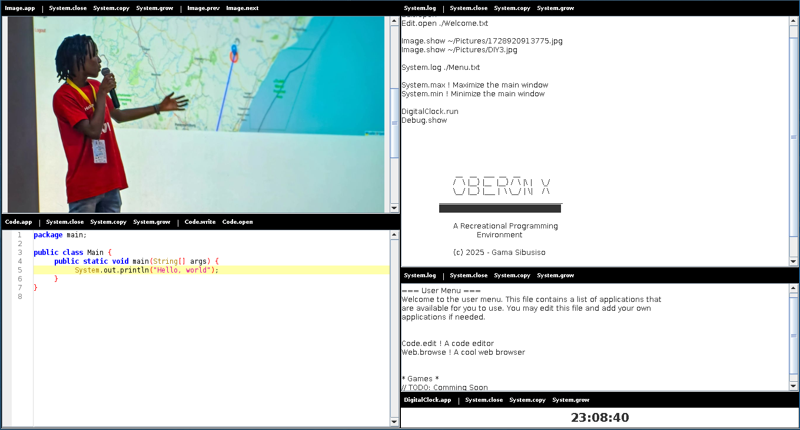

# OberonX

## What is OberonX
> OberonX is a java based programming environment inspired by the Oberon Operating System, created specially 
> for recreational programming. 

## Features
- A clean, non disruptive monochrome, TUI inspired display
- Oberon OS like command execution
- Graphics support
- API for creating user applications
- Dynamic `.jar` file loading

## Showcase

